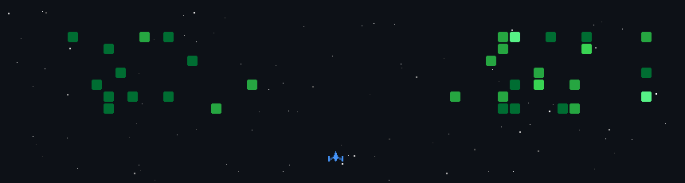

<!--  -->

## Django Backend Developer

     
- 🔧 Building RESTful APIs, working with relational databases, and designing reliable backend systems
- 🗄️ Experience with PostgreSQL, MySQL, and JWT authentication
- 🐳 Familiar with Docker for containerized development
- 🌱 Interested in backend architecture, system performance, and scalable API design
- 📫 Open to connecting and collaborating on backend-focused projects

🍁 𝐿𝑒𝑡 𝑚𝑒 𝑤𝑟𝑖𝑡𝑒 𝑖𝑡 𝑎𝑙𝑙 𝑏𝑦 ℎ𝑎𝑛𝑑 𝐴𝑛𝑑 𝐼'𝑙𝑙 𝑏𝑒 𝑡ℎ𝑒 𝑜𝑛𝑒 𝐼'𝑚 𝑡𝑜𝑙𝑑 𝐼 𝑐𝑎𝑛𝑛𝑜𝑡 𝑏𝑒...

## Tech Stack:

## Contact Me:

